# 🤖 AI Event Attendance Prediction System

A full-stack AI-powered event management platform that uses machine learning to predict attendance, flag no-shows, and optimize resource planning — built with **FastAPI + Python**, **ASP.NET Core 9 C#**, and **Angular 21**.

New in this version:
- ✅ **Standalone Angular components**
- 🔔 **In-app notification system** — bell icon, real-time polling, per-user storage
- 📧 **Transactional email system** — login alerts, registration confirmations, 1-day reminders

---

## 🏗️ System Architecture

```
┌─────────────────────────────────────────────────────────┐
│                    Angular 21 Frontend                  │
│              http://localhost:4200                      │
│      (UI, Auth, Events, Predictions, Reports)           │
└──────────────────────┬──────────────────────────────────┘
                       │ HTTP + JWT Bearer Token
                       ▼
┌─────────────────────────────────────────────────────────┐
│              ASP.NET Core 9 Web API (C#)                │
│              http://localhost:5000                      │
│  Auth · Events · Registrations · Reports                │
│  Prediction Proxy · Email Service · Reminder Worker     │
└──────────┬────────────────────────┬─────────────────────┘
           │ SQL Server (EF Core)   │ HTTP
           ▼                        ▼
  ┌─────────────────┐   ┌──────────────────────────────┐
  │   SQL Server DB  │   │     FastAPI (Python)        │
  │  EventPrediction │   │   http://localhost:8000     │
  │       DB         │   │  (3 ML Models — .pkl files) │
  └─────────────────┘   └──────────────────────────────┘
```

---

## 📁 Complete Directory Structure

```
Diya-ai-event-attendance-prediction/
│
├── docs/
│   ├── architecture-overview.md
│   ├── api-contracts.md
│   └── assumptions.md
    └── data-flow-diagram.md
│
├── 📂 api/                                    # Backend (.NET Core 9)
│   └── 📂 src/
        ├── Program.cs
│       ├── appsettings.json
        ├── appsettings.Development.json
        ├── appsettings.Testing.json
│       └── EventPredictionAPI.csproj
│       ├── 📂 Controllers/
│       │   ├── AuthController.cs
│       │   ├── EventsController.cs
│       │   ├── RegistrationsController.cs
│       │   ├── PredictionsController.cs
│       │   └── ReportsController.cs
│       │
│       ├── 📂 Models/
│       │   └── Models.cs
│       │
│       ├── 📂 DTOs/
│       │   └── DTOs.cs
│       │
│       ├── 📂 Data/
│       │   └── AppDbContext.cs
│       │
│       ├── 📂 Services/
│       │   ├── AuthService.cs
│       │   ├── EventService.cs
│       │   ├── RegistrationService.cs
│       │   ├── PredictionService.cs
│       │   ├── ReportService.cs
│       │   ├── EmailService.cs                 
│       │   └── ReminderBackgroundService.cs    
│       │
│       ├── 📂 Middleware/
│       │   └── ExceptionMiddleware.cs
│       │
│       ├── 📂 Migrations/
             └── 20260411140529_InitialCreate.cs
             └── 20260411140529_InitialCreate.Designer.cs
             └── AppDbContextModelSnapshot.cs
│   
│
├── 📂 api/tests/
     └── 📂 integration/                  # Integration tests
     │    ├── IntegrationTestBase.cs
     │    ├── AuthIntegrationTests.cs
     │    ├── EventsIntegrationTests.cs
     │    ├── RegistrationsIntegrationTests.cs
     │    ├── IntegrationTests.csproj
     │    └── ReportsIntegrationTests.cs
     │ 
     └── 📂 unit-tests/                     #Service tests 
          ├── AuthServiceTests.cs
│         ├── EventServiceTests.cs
│         ├── MSTestSettings.cs
│         ├── PredictionServiceTests.cs
│         └── RegistrationsServiceTests.cs
│
├── 📂 ui/                                     # Frontend (Angular 21)
│   └── 📂 src/app/
│       ├── app.config.ts                      # provideRouter, provideHttpClient
│       ├── app.routes.ts
│       │
│       ├── 📂 models/
│       │   └── models.ts
│       │
│       ├── 📂 services/
│       │   ├── auth.service.ts
│       │   ├── api.services.ts
│       │   ├── toast.service.ts
│       │   └── notification.service.ts       
│       │
│       ├── 📂 guards/
│       │   └── auth.guard.ts
│       │
│       ├── 📂 interceptors/
│       │   └── auth.interceptor.ts
│       │
│       └── 📂 components/
│           ├── 📂 landing/
│           ├── 📂 auth/
│           │   ├── 📂 login/
│           │   └── 📂 signup/
│           ├── 📂 dashboard/
│           ├── 📂 events/
│           ├── 📂 registrations/
│           ├── 📂 predictions/
│           │   ├── 📂 attendance-prediction/
│           │   ├── 📂 no-show-prediction/
│           │   └── 📂 user-attendance-prediction/
│           ├── 📂 resource-planning/
│           ├── 📂 reports/
│           └── 📂 shared/
│               ├── 📂 shell/
│               ├── 📂 notification-bell/      ← NEW
│               ├── 📂 toast/
│               └── 📂 navbar/
│
├── 📂 ui/tests/                               # Angular spec tests
│   ├── Component-tests/
│   │   ├── login.spec.ts
│   │   ├── signup.spec.ts
│   │   ├── dashboard.spec.ts
│   │   ├── events.spec.ts
│   │   ├── registrations.spec.ts
│   │   ├── attendance-prediction.spec.ts
│   │   ├── no-show-prediction.spec.ts
│   │   ├── user-attendance-prediction.spec.ts
│   │   ├── resource-planning.spec.ts
│   │   ├── reports.spec.ts
│   │   ├── notification-bell.spec.ts
│   │   ├── shell.spec.ts
│   │   ├── toast.spec.ts
│   │   ├── navbar.spec.ts
│   │   └── landing.spec.ts
│   └── Service-tests/
│       ├── auth.service.spec.ts
│       ├── api.services.spec.ts
│       ├── toast.service.spec.ts
│       └── notification.service.spec.ts
│
└── 📂 tools/ 
    ├── train_models.py
    ├── generate_datasets.py    
    ├── event_dataset.csv
    ├── user_event_dataset.csv
    ├── fastapi/                             # Python FastAPI ML service
        ├── main.py
        ├── requirements.txt
        ├── attendance_prediction_model.pkl
        ├── no_show_prediction_model.pkl
        └── user_attendance_model.pkl
    
```
---

## 🔧 Prerequisites

| Tool | Version | Download |
|---|---|---|
| Python | 3.9+ | [python.org](https://python.org) |
| .NET SDK | 9.0+ | [dotnet.microsoft.com](https://dotnet.microsoft.com/download) |
| Node.js | 18+ | [nodejs.org](https://nodejs.org) |
| SQL Server | 2019+ | [microsoft.com/sql](https://www.microsoft.com/en-us/sql-server/sql-server-downloads) |
| Angular CLI | 21+ | `npm install -g @angular/cli` |

---

## ⚙️ Setup & Installation

### Step 1 — Clone / Unzip the Project

```bash
mkdir Diyabaghla-ai-event-prediction
cd Diyabaghla-ai-event-prediction
```

---

### Step 2 — FastAPI Setup (Python ML Service)

```bash
cd tools/fastapi

# Create and activate virtual environment
python -m venv venv
venv\Scripts\activate             # Windows
# source venv/bin/activate        # macOS / Linux

# Install dependencies
pip install -r requirements.txt

# (Optional) Regenerate datasets and retrain models
python generate_datasets.py
python train_models.py

# Start the ML server
uvicorn main:app --host 0.0.0.0 --port 8000 --reload
```

✅ FastAPI runs at: **http://localhost:8000**
📖 Swagger docs at: **http://localhost:8000/docs**

---

### Step 3 — Backend Setup (ASP.NET Core 9)

#### 3a. Configure `appsettings.json`

```json
{
  "ConnectionStrings": {
    "DefaultConnection": "Server=localhost;Database=EventPredictionDB;Trusted_Connection=True;TrustServerCertificate=True;"
  },
  "Jwt": {
    "Key": "YourSuperSecretKeyHere_AtLeast32Characters!!",
    "Issuer": "EventPredictionAPI",
    "Audience": "EventPredictionClient",
    "ExpiresInHours": "24"
  },
  "FastAPI": {
    "BaseUrl": "http://localhost:8000"
  },
  "EmailSettings": {
    "FromEmail":   "your-gmail@gmail.com",
    "FromName":    "EventAI Platform",
    "SmtpHost":    "smtp.gmail.com",
    "SmtpPort":    587,
    "Username":    "your-gmail@gmail.com",
    "AppPassword": "xxxx xxxx xxxx xxxx"
  }
}
```

> ⚠️ **Gmail:** Enable 2-Step Verification → generate an App Password at [myaccount.google.com/apppasswords](https://myaccount.google.com/apppasswords). Use that as `AppPassword` — never your real Gmail password.

#### 3b. Run Database Migrations

```bash
cd api/src

dotnet tool install --global dotnet-ef   # if not installed
dotnet restore
dotnet ef database update
```

#### 3c. Start the API

```bash
cd api/src
dotnet run
```

✅ API runs at: **http://localhost:5000**

---

### Step 4 — Frontend Setup (Angular 21)

```bash
cd ui/

npm install
ng serve
```

✅ Frontend runs at: **http://localhost:4200**

---

## 🚀 Running All Three Services

Open **three terminal windows**:

```bash
# Terminal 1 — FastAPI (ML Models)
cd tools
cd fastapi
venv\Scripts\activate
uvicorn main:app --host 0.0.0.0 --port 8000 --reload

# Terminal 2 — ASP.NET Core API
cd api/src
dotnet run

# Terminal 3 — Angular Frontend
cd ui
ng serve
```

Open your browser at **http://localhost:4200**

---

## 🗄️ Database Schema

```
┌──────────────────────────────────────┐
│               Users                  │
├──────────────────────────────────────┤
│ Id (PK)  FullName  Email (Unique)    │
│ PasswordHash  Role  CreatedAt        │
└──────────────────┬───────────────────┘
                   │ 1:N
┌──────────────────▼───────────────────┐
│            Registrations             │
├──────────────────────────────────────┤
│ Id (PK)  UserId (FK)  EventId (FK)  │
│ RegistrationDate  Status             │
│ DaysBeforeRegistration               │
│ PastUserAttendanceRate               │
└──────────────────┬───────────────────┘
                   │ N:1
┌──────────────────▼───────────────────┐
│               Events                 │
├──────────────────────────────────────┤
│ Id (PK)  Title  Description          │
│ EventType  Mode  Department          │
│ EventDate  DayOfWeek  DurationHours  │
│ SpeakerRating  ReminderSent          │
│ PastAttendanceRate  Weather          │
│ TicketPrice  LocationCapacity        │
│ CreatedAt                            │
└──────────────────────────────────────┘
```

---

## 🌐 API Reference

### FastAPI (Port 8000)

| Method | Endpoint | Description |
|---|---|---|
| `POST` | `/predict-attendance` | Predict total attendance count |
| `POST` | `/predict-no-show` | Predict Attend / Not Attend + probability |
| `POST` | `/predict-user-attendance` | Return attendance probability (0–1) |

### ASP.NET Core API (Port 5000)

#### Auth
| Method | Endpoint | Auth | Description |
|---|---|---|---|
| `POST` | `/api/auth/signup` | Public | Register new user |
| `POST` | `/api/auth/login` | Public | Login + receive JWT + login email sent |

#### Events
| Method | Endpoint | Auth | Description |
|---|---|---|---|
| `GET` | `/api/events` | User | Get all events |
| `GET` | `/api/events/{id}` | User | Get event by ID |
| `POST` | `/api/events` | Admin | Create event |
| `PUT` | `/api/events/{id}` | Admin | Update event |
| `DELETE` | `/api/events/{id}` | Admin | Delete event |

#### Registrations
| Method | Endpoint | Auth | Description |
|---|---|---|---|
| `POST` | `/api/registrations` | User | Register for event + confirmation email sent |
| `PATCH` | `/api/registrations/{id}/cancel` | User | Cancel registration |
| `GET` | `/api/registrations/my` | User | Get my registrations |
| `GET` | `/api/registrations/event/{id}` | Admin | Get registrations for an event |
| `GET` | `/api/registrations` | Admin | Get all registrations |

#### Predictions (proxies to FastAPI)
| Method | Endpoint | Auth | Description |
|---|---|---|---|
| `GET` | `/api/predictions/attendance/{eventId}` | User | Predict attendance (capped to registrations) |
| `GET` | `/api/predictions/no-show/{eventId}` | User | Predict no-show risk |
| `GET` | `/api/predictions/user-attendance/{eventId}` | User | User attendance probability |

#### Reports
| Method | Endpoint | Auth | Description |
|---|---|---|---|
| `GET` | `/api/reports/attendance-vs-registration` | Admin | Attendance vs registrations |
| `GET` | `/api/reports/cancelled-vs-registered` | Admin | Cancellation summary |
| `GET` | `/api/reports/event-performance` | Admin | Fill rates & ratings |
| `GET` | `/api/reports/top-stats` | Admin | Platform-wide KPIs |
| `GET` | `/api/reports/department-breakdown` | Admin | By department & mode |
| `GET` | `/api/reports/weekly-trend` | Admin | Weekly registration trend |
| `GET` | `/api/reports/download/event-performance-csv` | Admin | Download CSV |
| `GET` | `/api/reports/download/registrations-csv` | Admin | Download CSV |
| `GET` | `/api/reports/download/department-csv` | Admin | Download CSV |

---

## 🔔 Notification System

In-app notifications appear as a bell icon in the top navbar.

| Notification | Trigger |
|---|---|
| 📅 New Event Added | Admin creates an event |
| 🎫 Registration Confirmed | User registers for an event |
| ⏰ 2 Days Left | 2 days before a registered event |
| ⚡ Tomorrow! | 1 day before a registered event |
| 🎉 Event Today! | Day of a registered event |

- Notifications are **per-user** — stored in `localStorage` namespaced by JWT user ID
- Bell shows a **red badge** with unread count
- All notifications persist across page refreshes and browser sessions
- Clears automatically on logout

---

## 📧 Email System

Three types of emails are sent automatically via **Gmail SMTP**:

| Email | When |
|---|---|
| ✅ Login Success | Every successful login |
| 🎫 Registration Confirmed | After registering for an event (includes full event details) |
| ⏰ Event Reminder | Automatically 1 day before each registered event |

All emails are **fire-and-forget** — they never delay API responses. If email fails, the app continues normally.

**Gmail setup:**
1. Enable 2-Step Verification on your Gmail
2. Go to [myaccount.google.com/apppasswords](https://myaccount.google.com/apppasswords)
3. Generate an App Password and paste it into `appsettings.json`

---

## 🔒 Authentication Flow

```
User → POST /api/auth/login { email, password }
     ← JWT Token (24h expiry) + login email sent

All subsequent requests:
Authorization: Bearer <token>

Angular AuthInterceptor automatically attaches the token.
401 response → auto logout → redirect to /login.
```

### User Roles

| Role | Permissions |
|---|---|
| `User` | View events, register/cancel, run predictions, receive emails & notifications |
| `Admin` | All User permissions + create/edit/delete events, view all registrations & reports |

> **To create an Admin:** sign up normally, then run this SQL:
> ```sql
> UPDATE Users SET Role = 'Admin' WHERE Email = 'your@email.com'
> ```

---

## 🤖 ML Models

| Model | Algorithm | Predicts | Accuracy |
|---|---|---|---|
| `attendance_prediction_model.pkl` | RandomForestRegressor | Attendee count | R² = 0.99 |
| `no_show_prediction_model.pkl` | RandomForestClassifier | Attend / Not Attend | 97% |
| `user_attendance_model.pkl` | RandomForestClassifier | Probability (0–1) | 74% |


---

## 🧪 Running Tests

### Backend Integration Tests

```bash
cd api/tests
cd unit-tests        # service tests
dotnet test 

cd api/tests
cd integration
dotnet test          #integration tests
```

Covers: Auth, Events, Registrations, Reports — ~62 tests using SQLite in-memory.

### Frontend Component & Service Tests

```bash
cd ui
cd tests

# Run all tests
ng test --watch=false --browsers=ChromeHeadless

# Run specific file
ng test --watch=false --browsers=ChromeHeadless --include="tests/Component-tests/login.spec.ts"

# Run all service tests
ng test --watch=false --browsers=ChromeHeadless --include="tests/Service-tests/**/*.spec.ts"
```

Covers: 15 components + 4 services — ~400+ tests total.

---

## 🧪 First Time Usage

1. Open **http://localhost:4200**
2. Click **Get Started** → create your account
3. Log in → check your Gmail for a login notification email
4. **Create an event** (requires Admin role — update DB manually for first admin)
5. **Register** for the event → check Gmail for confirmation email
6. **Run Attendance Prediction** → select event → click Predict
7. **Run No-Show Prediction** → see risk level and recommendations
8. **View Resource Planning** → get auto-calculated chairs / food / staff
9. **View Reports** → see live charts, download CSV exports
10. **Check notification bell** → see in-app reminders appear 2 days and 1 day before events

---

## Screenshots of project
#### Landing page
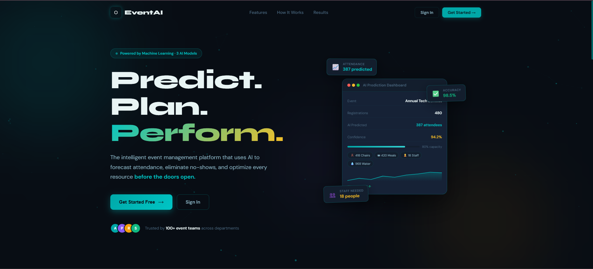
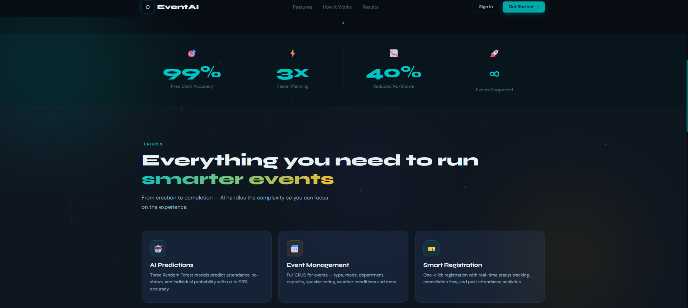

#### Dashboard
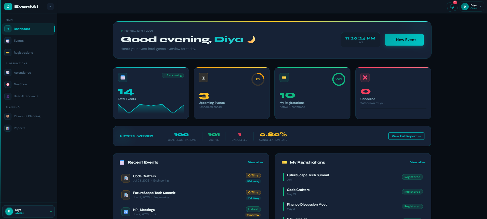

#### Dashboard With notification bar
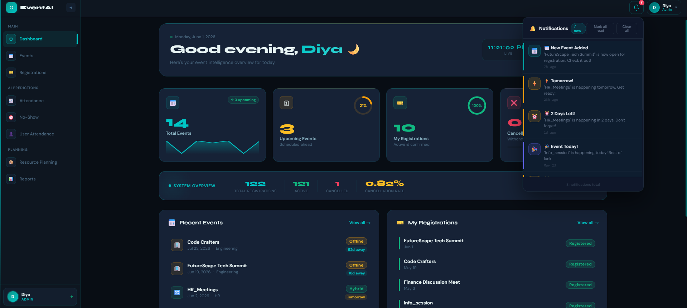

#### Events page
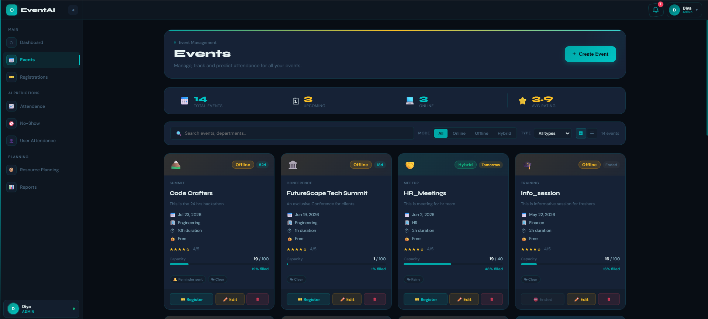

#### Registrations page
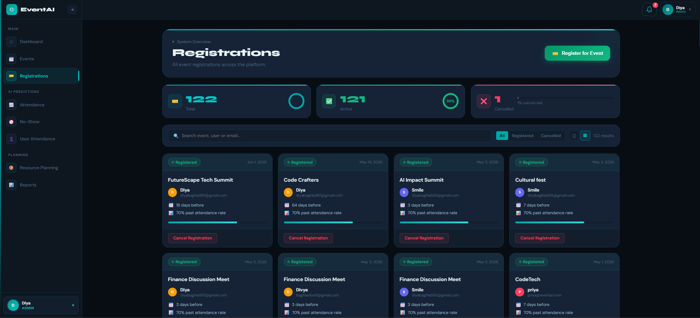

#### Attendance-prediction 
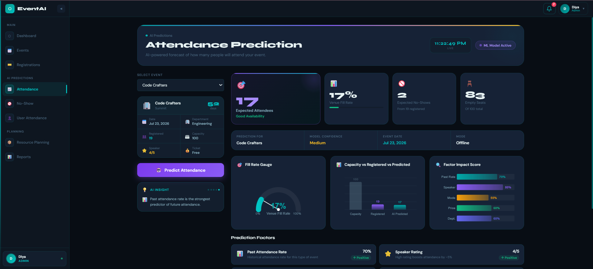

#### No-Show Prediction
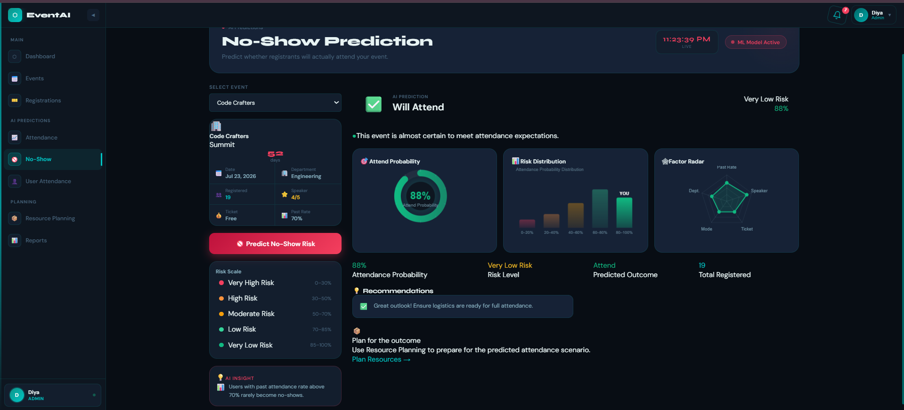

#### User-Attendance Prediction
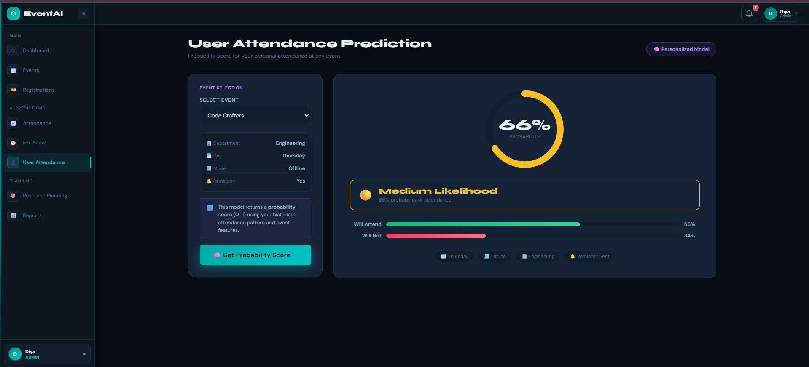

#### Resource-planning
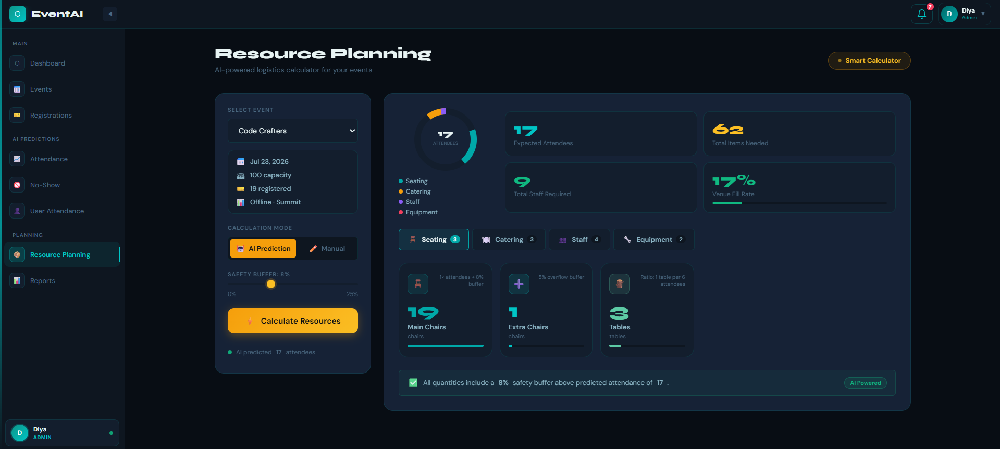
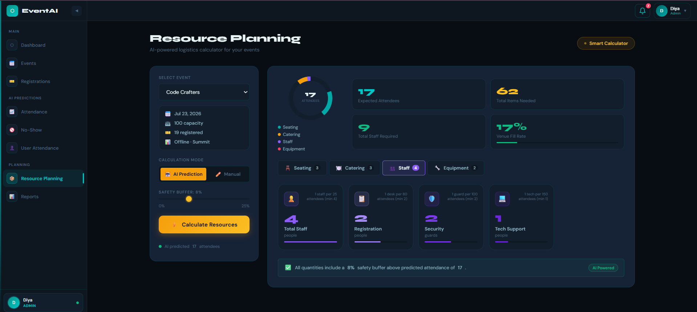

#### Reports
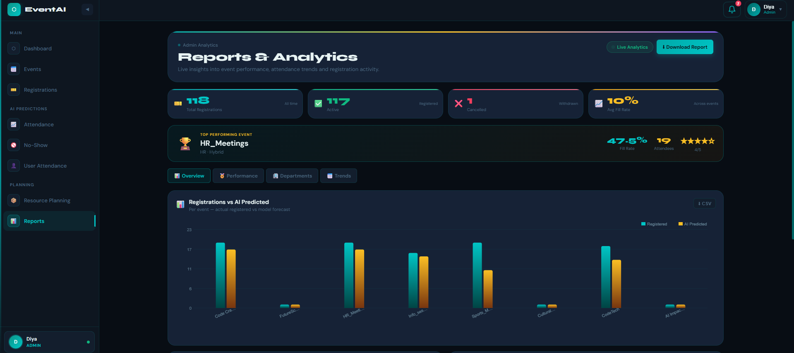
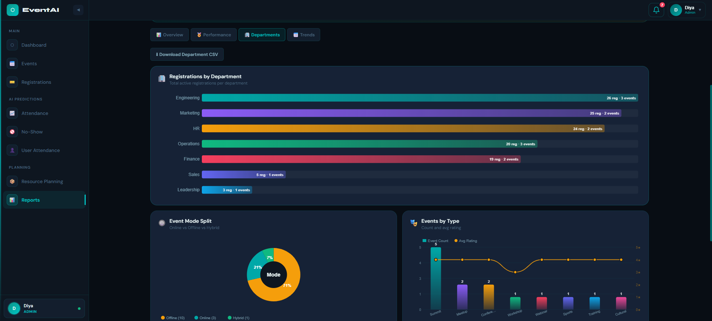

## 🛠️ Troubleshooting

| Problem | Solution |
|---|---|
| `Prediction failed` | Ensure FastAPI is running on port 8000 with `.pkl` files present |
| `401 Unauthorized` | Token expired → log out and log in again |
| `Cannot connect to DB` | Check SQL Server is running and connection string is correct |
| `CORS error` | Ensure ASP.NET Core API is running on port 5000 |
| Angular keeps loading | Check browser Network tab — ensure API calls return 200 |
| No emails received | Verify Gmail App Password in `appsettings.json`; check spam folder |
| Bell not showing notifications | Check browser console for JWT claim name; ensure `startPolling()` is called in Shell |
| `dotnet ef not found` | Run `dotnet tool install --global dotnet-ef` |
| Model file not found | Ensure `.pkl` files are in the `tools/` directory |

---

## 📦 Tech Stack Summary

| Layer | Technology | Key Libraries |
|---|---|---|
| **ML Service** | Python 3.9 + FastAPI | `scikit-learn`, `joblib`, `pandas`, `uvicorn` |
| **Backend API** | C# / .NET 9 + ASP.NET Core | EF Core, BCrypt.Net, JWT Bearer, SmtpClient |
| **Database** | SQL Server LocalDB | — |
| **Frontend** | Angular 21 + TypeScript | RxJS, Signals, Reactive Forms, Canvas API |
| **Auth** | JWT HS256 | 24h token, role-based access control |
| **Email** | Gmail SMTP | App Password, TLS port 587, fire-and-forget |
| **Notifications** | Angular Signals | localStorage per-user, 60s polling |
| **Styling** | SCSS design system | CSS variables, Syne + DM Sans fonts |
| **Testing** | Jasmine + Karma (Angular), xUnit (.NET) | SQLite in-memory, HttpTestingController |

---

## 📄 License

MIT License — free to use, modify, and distribute.
